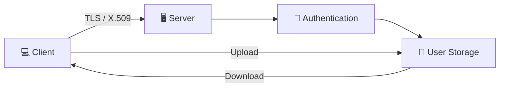
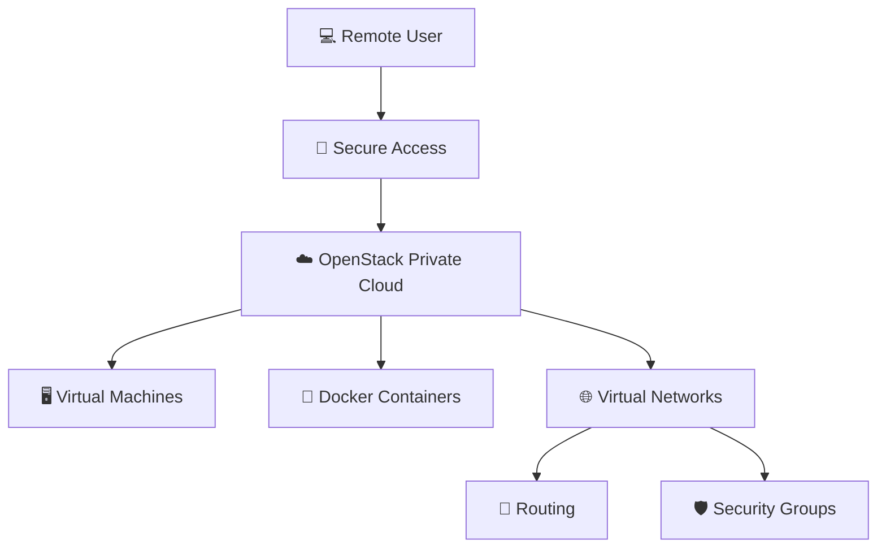
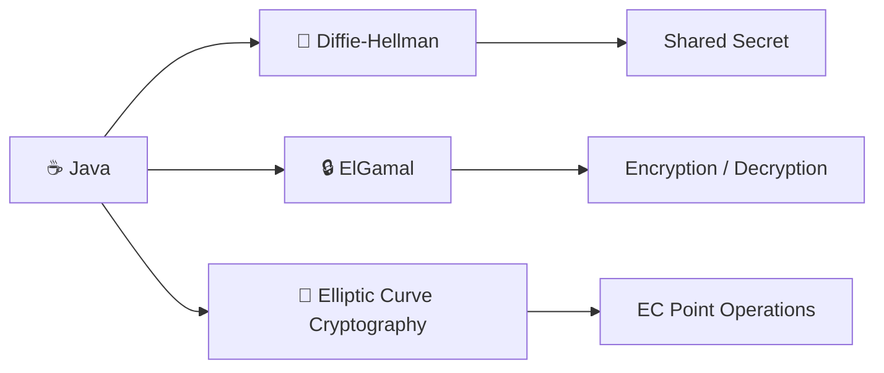
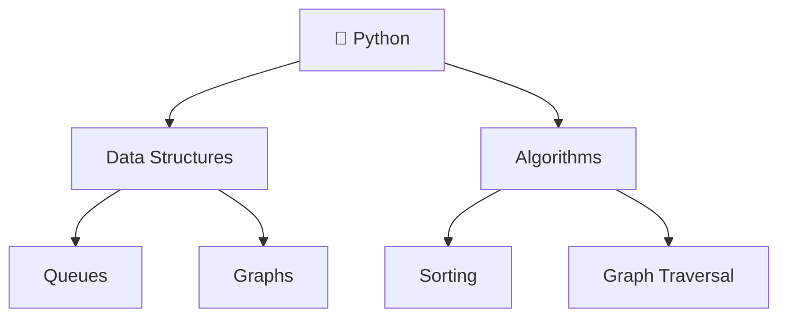

```text
          __________                    \  |  /                          _________
     ___(      _____`)____            ~  .---.  ~                 _____(   _______ `)__
   (_________(  `    )____)         --  (  ^  )  --             (_________(  `    )____)
            (__________)              ~  '---'  ~                        (_____________)
                                        /  |  \

  ♥ ♥    _     _    ♥ ♥       _(_)_                          wWWWw   _         ♥ ♥    _     _    ♥ ♥
        (')-=-(')        @@@@ (_)@(_)   vVVVv     _     @@@@  (___) _(_)_           (')-=-(')
      __(   "   )__     @@()@@  (_)\    (___)   _(_)_  @@()@@   Y  (_)@(_)        __(   "   )__
     / _/'-----'\_ \     @@@@      `|/    Y    (_)@(_)  @@@@   \|/   (_)\        / _/'-----'\_ \
  ___\\ \\     // //___   /         \|    \|/    /(_)    \|      |/      |     ___\\ \\     // //___
jgs >____)/_\---/_\(____< \ |        | / \ | /  \|/       |/    \|      \|/ jgs >____)/_\---/_\(____<
^^^^^^^^^^^^^^^^^^^^^^^^^^\\|//^^^^^\\|///\\|///^\|///^^^\\|//^^\\|//^^^^^^^^^^^^^^^^^^^^^^^^^^^^^^^^^^
```

# Hi, I'm Katherine 🍓🐸

### IT & Cybersecurity | Networking • Linux • Cloud • Digital Forensics

`Python 🐍` • `Java ☕` • `Bash </>` • `C`

---

## 🍓 About Me

I'm an IT and cybersecurity professional with a background in hands-on technical support, networking, security, cloud infrastructure, and programming.

I like figuring out how systems work, troubleshooting the problems that make absolutely no sense at first, and learning the technology behind the tools I use.

I'm especially interested in **cybersecurity, network security, Linux, cloud infrastructure, digital forensics, and security engineering**.

---

## 🐸 Tech I Work With

**Programming**  
`Python 🐍` `Java ☕` `Bash </>` `C`

**Security**  
`Wireshark` `Nmap` `Metasploit` `SentinelOne` `TLS/SSL` `X.509` `Vulnerability Management`

**Networking**  
`TCP/IP` `VLANs` `DHCP` `DNS` `VPN` `Firewalls` `Packet Capture & Analysis`

**Infrastructure & Systems**  
`Linux` `Windows` `macOS` `OpenStack` `Docker` `VMware` `AWS`

---

# ⭐ Featured Projects

## 🔐 Secure File Synchronization

A Python client-server file synchronization system using secure network communication, authentication, TLS, X.509 certificates, file handling, and multithreading.



`Python` `Networking` `TLS` `X.509` `Authentication` `Multithreading`

---

## ☁️ OpenStack Private Cloud Infrastructure

Private cloud infrastructure developed using OpenStack, Docker, Linux, networking, and virtualization to support remotely accessible virtual lab environments.



`OpenStack` `Docker` `Linux` `Networking` `Virtualization` `Cloud Infrastructure`

---

## 🔑 Cryptography Algorithms in Java

Educational Java implementations exploring public-key cryptography and the mathematical concepts behind secure communication.



`Java` `Cryptography` `Diffie-Hellman` `ElGamal` `ECC`

---

## 🐍 Python Data Structures & Algorithms

Selected Python implementations demonstrating programming fundamentals, data structures, and algorithm design.



`Python` `Data Structures` `Algorithms` `Graphs` `Queues`

---

## 🌱 What I'm Exploring

I'm continuing to build my skills in:

- 🔐 Security engineering
- 🔎 Threat detection and analysis
- 🌐 Network security
- 🐧 Linux
- ⚙️ Security automation
- ☁️ Cloud security

---

```text
$ whoami
> strawberry-frog

$ current_status
> learning one weird error at a time...

$ exit
> thanks for stopping by 🍓🐸
```


